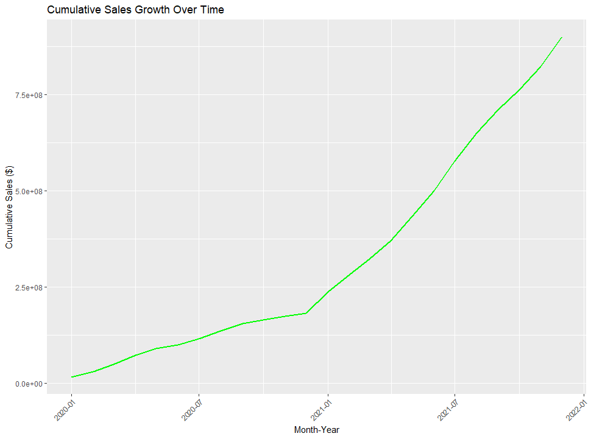

# 📊 **Adidas U.S. Sales Insights**  

## 📑 **Table of Contents**  
1. [Overview](#overview)  
2. [Tools & Technologies](#tools-technologies)  
3. [Data Source](#data-source)  
4. [Business Requirements & Problems](#business-requirements-problems)  
5. [Data Exploration in R](#data-exploration-in-r)  
   - 5.1 [Data Structure & Missing Values](#data-structure-missing-values)  
   - 5.2 [Data Summary](#data-summary)  
6. [Visual Analysis in R](#visual-analysis-in-r)  
   - 6.1 [Total Sales Over Time](#total-sales-over-time)  
   - 6.2 [Sales by Product Category](#sales-by-product-category)  
   - 6.3 [Operating Profit vs Total Sales](#operating-profit-vs-total-sales)  
7. [Power BI Dashboard Design](#power-bi-dashboard-design)  
8. [Key Business Recommendations](#key-business-recommendations)  
9. [Next Steps](#next-steps)  
10. [Project Structure](#project-structure)  
11. [Contact Information](#contact-information)

---

## 📝 **Overview (2020–2021)**  
Welcome to the **Adidas U.S. Sales Insights** project! This project combines **Power BI** for interactive dashboards and **R** for advanced data exploration, unveiling key insights into Adidas' sales performance. You'll discover trends, identify top performers, and uncover regional sales dynamics—empowering business decisions that can drive growth.

---

## ⚙️ **Tools & Technologies Used**  
To deliver rich insights and interactive visuals, the following tools and technologies were used:

- **R** for data analysis and advanced statistical modeling  
- **Power BI** for interactive data visualization and dashboard design  
- **R Libraries**: `ggplot2`, `dplyr`, `lubridate`, `readxl`, `stringr`  
- **Web Technologies**: `HTML`, `CSS`, `JavaScript`

---

## 📂 **Data Source**  
The dataset for this project is derived from **Adidas' U.S. sales**, encompassing a range of variables to help us explore sales performance.

- **File Name**: `Adidas US Sales Datasets.xlsx`  
- **Rows**: 9,648  
- **Columns**: 13  

### Key Columns:  
- **Invoice Date**  
- **Region/State/City**  
- **Product**  
- **Price per Unit**  
- **Units Sold**  
- **Total Sales**  
- **Operating Profit**  
- **Sales Method**  

---

## 💡 **Business Requirements & Problems**  
The goal of this project is to solve the following key business problems:

1. Analyze the sales performance trends over time.  
2. Understand how sales vary across different regions.  
3. Identify the top-performing products.  
4. Assess the effectiveness of sales methods (online vs. in-store).  
5. Evaluate profitability and uncover cost-saving opportunities.

---

## 🔍 **Data Exploration in R**  
Before diving into visual analysis, we first explored the dataset to ensure it's clean and ready for analysis.

### **Data Structure & Missing Values**  
We began by checking the structure of the dataset and identifying any missing values that could affect our analysis.  
  
*Exploring the data structure*

We handled missing values carefully to ensure accuracy in the subsequent analysis.  
  
*Checking for missing values*

### **Data Summary**  
After cleaning, we calculated key statistical metrics to uncover insights into sales and profitability.  
  
*Statistical summary of the dataset*

---

## 📈 **Visual Analysis in R**  
Next, we used **R** to create powerful visualizations that bring the data to life. These insights will help identify trends and key business opportunities.

### **Total Sales Over Time**  
We visualized how total sales evolved over time, revealing seasonal trends and growth patterns.  
  
*Sales growth over time*

### **Sales by Product Category**  
A bar chart was used to highlight sales across different product categories, showcasing **Men’s Athletic Footwear** as a top performer.  
  
*Sales distribution across product categories*

### **Operating Profit vs Total Sales**  
We also analyzed the relationship between operating profit and total sales, offering insights into how profitability correlates with overall sales.  
  
*Operating Profit vs Total Sales*

---

## 📊 **Power BI Dashboard Design**  
To make these insights interactive and user-friendly, we designed a Power BI dashboard that lets users explore the data visually. This dashboard brings together everything we've learned from R and presents it in an engaging format.

**Dashboard Pages**:  
1. **Sales Overview**  
2. **Product Analysis**  
3. **Sales Method & Growth**  
4. **Deep Dive Analysis**  

**Visualization:**

  
*Power BI Dashboard - Sales Insights*

Check out the interactive experience in this demo video:  
[View Dashboard Demo Video](./assets/videos/dashboard_demo_video.mp4)

---

## 📈 **Key Business Recommendations**  
Based on the analysis, here are the key business recommendations to drive growth and improve profitability:

- Focus marketing efforts in **Q4** for seasonal sales surges.  
- Expand the product line in high-margin categories, such as **Men’s Athletic Footwear**.  
- Boost online sales, especially in underperforming regions.  
- Optimize pricing for high-revenue products to improve margins.  
- Ensure inventory is sufficient in high-demand regions, particularly in the **Northeast**.

---

## 📂 **Project Structure**  
Here’s an overview of the project folder structure, where each component is organized for easy navigation:

```
Adidas-Sales-Dashboard/
│
├── assets/
│   ├── images/
│   │   ├── R-Studio/
│   │   │   ├── data%20exploration/
│   │   │   ├── plots/
│   │   └── Power BI/
│   ├── videos/
│   │   └── dashboard_demo_video.mp4
├── R-Scripts/
│   └── analysis.R
├── Power-BI/
│   └── adidas_sales_dashboard.pbix
├── README.md
└── Adidas US Sales Datasets.xlsx
```

- **assets/images/**: Contains the images used in the README, including charts and visualizations.  
- **assets/videos/**: Includes videos like the dashboard demo.  
- **R-Scripts/**: Contains R scripts for data analysis.  
- **Power-BI/**: The Power BI file for the dashboard.  
- **README.md**: This documentation file.  
- **Adidas US Sales Datasets.xlsx**: The source dataset.

---

## 📞 **Contact Information**  
Feel free to connect for any inquiries or collaboration opportunities:

- [LinkedIn](https://www.linkedin.com/in/jeremiah-o-517729122/)  
- [GitHub](https://github.com/ewache04/Adidas-Sales-Dashboard)
- [Website View](https://ewache04.github.io/Adidas-Sales-Dashboard/)